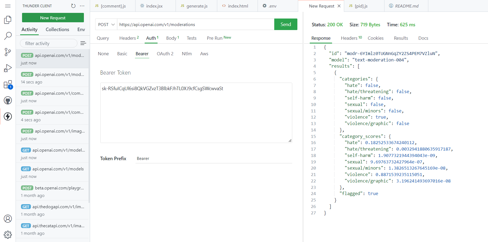

- [PRÁCTICA - NETX.JS](#práctica---netxjs)
  - [1. Generador de nombres](#1-generador-de-nombres)
  - [2. Generador de imágenes](#2-generador-de-imágenes)
  - [3. Despliegue en Netlify](#3-despliegue-en-netlify)
  - [4. Separación código en varios ficheros](#4-separación-código-en-varios-ficheros)
  - [5. Ejercicios REST](#5-ejercicios-rest)

  ## 1. Generador de nombres
Para el generador de nombres debemos mdodifcar el código de index.js. Para hacer la petición a la API de OpenAI y escribir con POST a espera de una respuesta necesitamos el siguiente código:

Una vez completado el codigo para de index.js. Nos aparecera la api para generar nombre:

## 2. Generador de imágenes
Para el generador de imágenes debemos modificar el código de index.js y crear en la carpeta /pages/api/ otro fichero para acceder a la generación de imágenes. Para hacer la petición a la API de OpenAI y escribir con POST a espera de una respuesta necesitamos este código en /pages/pai/images.js:

Luego para adaptar el índice a la salida esperada cambiamos el texto para solicitar qué imagen quiere el cliente y finalmente la imprimimos por pantalla.
Una vez completado el codigo para de index.js. Nos aparecera la api para generar imágenes:

## 3. Despliegue en Netlify
Se puede ver el despliegue en Netlify [pinchando aqui](https://main--curious-beignet-dbddca.netlify.app/):

## 4. Separación código en varios ficheros

Primero creamos el índice en index.js:

Su principal función es llamar a las funciones de los otros ficheros. Los otros ficheros son images.js, pet.js y 404.js, esto nos llevarian a sus respectivos generadores de imágenes, nombres y errores 404.

Con todo esto ya podríamos mostrar el despliegue y navegar entre ellos.

## 5. Ejercicios REST

1. Todos los modelos:

2. Información sobre un modelo:

3. Generador de una imagen:

4. Completar una frase:

5. Moderación (clasifica si el texto viola el OpenAI's Content Policy):

